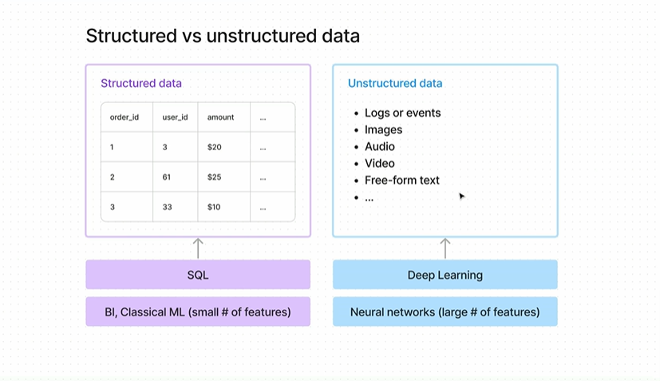

# Notes: Data Generation & Source Systems (Simplified)

### 1. Where Data Comes From

* Data sources are everywhere → apps, IoT devices, third-party systems.
* New sources keep growing all the time.
* We’ll only focus on the most important ones for data engineers.

---

### 2. Two Main Types of Data

#### **Structured Data**

* Looks like **tables** (rows + columns).
* Very common in analytics and business reporting.
* Example: customer table, orders table.
* We use **SQL** to store, search, and process it.

#### **Unstructured Data**

* Comes as **files** → logs, images, audio, video, free text.
* Example: CCTV footage, tweets, Reddit posts, Wikipedia articles.
* Often used in **AI and deep learning**.

---

### 3. Why the Difference Matters

* **Storage & Processing are different**:

  * Structured → works well with SQL and traditional ML.
  * Unstructured → needs neural networks / deep learning.

---

### 4. Features / Dimensions

* Structured data → only a **limited number of features (columns)**.
* Unstructured data → **huge number of features** (pixels in images, words in text, etc.).
* That’s why we need deep learning for unstructured data.

---

### 5. Key Takeaway

* Always ask: *Am I dealing with structured or unstructured data?*
* This helps you decide:

  * **How to store it** (databases vs object storage).
  * **How to process it** (SQL vs AI/ML methods).
* Don’t worry if it feels confusing now → it will become clear with practical examples.

---

# 📌 Structured vs Unstructured Data – Real World Examples

### **Structured Data (Tabular → Rows & Columns)**

👉 Best for analytics, reporting, dashboards.

* **E-commerce orders** → Order ID, customer name, product, price, quantity, timestamp.
* **Bank transactions** → Account number, transaction ID, amount, date, type (credit/debit).
* **Employee records** → Employee ID, name, role, salary, department.
* **IoT sensor readings** → Sensor ID, temperature, humidity, timestamp.

💡 *Think of structured data as neat spreadsheets or tables that fit perfectly into databases like PostgreSQL or MySQL.*

---

### **Unstructured Data (Files, Free-form, No fixed schema)**

👉 Best for AI, deep learning, text or image analysis.

* **Product reviews on Amazon** → Long text, emojis, ratings, mixed opinions.
* **Customer support chats** → Conversations in natural language.
* **CCTV footage** → Video files from cameras.
* **Self-driving car sensors** → Continuous video, LIDAR scans, radar signals.
* **Medical images** → MRI scans, X-rays, CT scans.
* **Social media posts** → Tweets, Instagram captions, YouTube comments.

💡 *Unstructured data doesn’t fit into rows/columns easily → it needs special storage (like AWS S3, data lakes) and special processing (AI, NLP, computer vision).*

---
