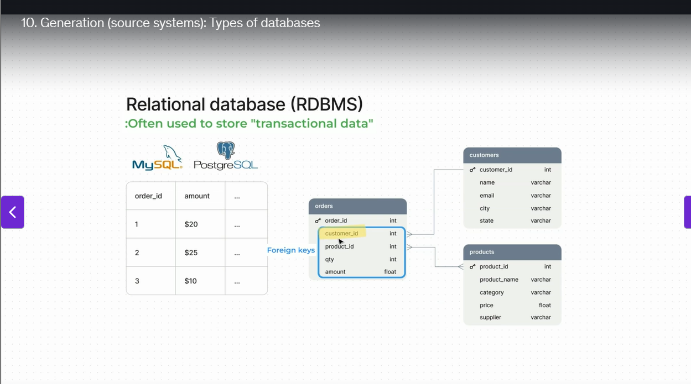
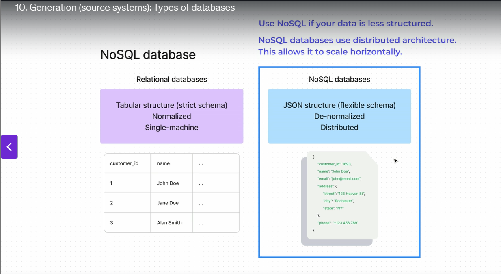
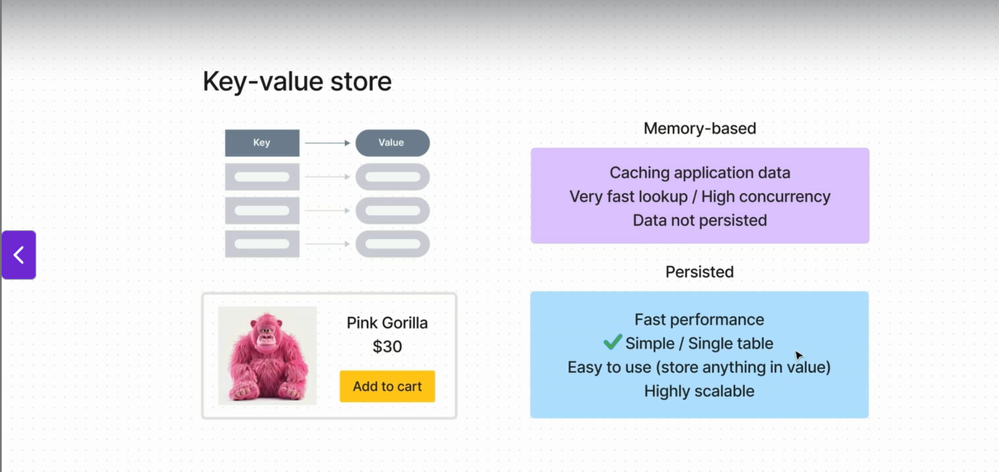

# 📌Types of Databases

### 🔹 Why Databases Matter

* Choosing the right database is critical → wrong choice can lead to performance issues as you scale.

* Three main types we should know:

  1. **Relational Databases (RDBMS)**
  2. **Non-Relational Databases (NoSQL)**
  3. **Key-Value Stores**

---

### 1️⃣ Relational Databases (RDBMS → Relational Database Management System)

* One of the most common types of databases.
* Widely used for application backends to store **transactional data**.

**Example:**

* An order from an e-commerce store.
* When an order is made, it is saved inside a relational database like **MySQL** or **Postgres** in a **tabular format**.
* Each row = a separate order.
* Columns = information about each order (e.g., order ID, amount).

**Keys:**

* **Primary Key** → unique field for each row.

  * Example: order ID is a primary key in the orders table (only one unique order ID per table).
* **Foreign Key** → references other tables.

  * Example: orders table may have a customer ID field that connects to the customer table.

**Why “Relational”?**

* Because it has multiple tables (e.g., orders, customers) that are connected by relations.

---

### 2️⃣ Non-Relational Databases (NoSQL → “Not Only SQL”)

* Even though relational databases are powerful, they don’t fit all use cases.
* Sometimes relational DBs are too inflexible.

**Example:**

* **MongoDB** (uses JSON structure).
* JSON allows a much more **flexible schema** compared to rigid tabular structures.
* Example: nested data in an “address” field (not possible in traditional relational DBs).

**Schema Difference:**

* Relational DB → strict schema.
* NoSQL → flexible schema (good for less structured data).

**Trade-offs:**

* Relational DB strict schema = more **normalized data structures**.
* NoSQL flexible schema = easier for less structured data, but less normalized.

**Scaling Difference:**

* Relational DBs → typically run on a single machine. To scale, you need a bigger machine → eventually you hit a limit.
* NoSQL → built on **distributed architecture**. To scale, you just add more machines (horizontal scaling).

---

### 3️⃣ Key-Value Stores

* A type of **non-relational database**.
* Retrieve data based on a **unique key**.
* Works like **key-value pairs** (like an object in JavaScript or a dictionary in Python, but more scalable).

**Types:**

1. **Memory-based key-value stores**

   * Very fast lookup, high concurrency.
   * Used for **caching** application data.
   * Limitation: data is not persisted (lost if DB shuts down).

2. **Persistent key-value stores**

   * Store data permanently.

**Advantages:**

* Very fast (no table joins).
* Simple structure, no rigid schema (you can store anything as a value).
* Easy horizontal scaling.

**Example Use Case:**

* Storing items in a **shopping cart** during a busy holiday season.
* Billions of orders per second might need to be handled.
* Key-value stores can handle **extremely high volumes of data** and **millions of simultaneous user sessions**.

---

✅ **Summary in One Line:**

* **RDBMS** → structured, strict schema, good for transactions.
* **NoSQL** → flexible schema, distributed, good for unstructured/semi-structured, scales horizontally.
* **Key-Value** → simplest, ultra-fast lookups, great for caching and high concurrency.

---

Would you like me to also **make a small visual diagram** (tables linked → JSON doc → key-value pairs) that you can paste into your notes for quick recall?

### 1️⃣ Relational Databases (RDBMS)

* Most common, widely used for application backends.
* Store **transactional data** in **tables (rows & columns)**.
* Example: e-commerce order saved in MySQL or Postgres.
* **Primary key** → unique field per row (e.g., order ID).
* **Foreign key** → connects tables (e.g., customer ID links orders table with customers table).
* Called **relational** because tables are linked by relationships.
* Strength: strict schema, normalized structure.
* Limitation: mostly single-machine, harder to scale horizontally.

---

### 2️⃣ Non-Relational Databases (NoSQL → “Not only SQL”)

* Designed for flexibility, not rigid like RDBMS.
* Example: MongoDB stores data as **JSON documents** (nested data allowed).
* Schema = flexible (good for less structured data).
* Built for **distributed architecture** → scales horizontally (add more machines).
* Trade-offs:

  * Less strict structure = easier to store varied data.
  * But lacks the normalization and strong schema guarantees of RDBMS.
* Good choice when data is semi-structured or unstructured, and when you need scalability.

---

### 3️⃣ Key-Value Stores

* Simplest type of NoSQL database → data stored as **key-value pairs**.
* Similar to a **Python dictionary or JavaScript object**, but at massive scale.
* Two types:

  * **Memory-based** → super fast, used for caching (but data lost when server shuts down).
  * **Persistent** → data is stored permanently.
* Advantages:

  * Very high performance (no table joins).
  * Easy to use (no rigid schema).
  * Horizontal scaling built-in.
* Example use case: **shopping carts during Black Friday** → millions of users adding/removing items at the same time.

---

✅ **Key Takeaway for Interviews**

* **RDBMS** → structured, normalized, strict schema, good for transactions.
* **NoSQL** → flexible, distributed, good for unstructured/semi-structured, scales easily.
* **Key-Value Stores** → ultra-fast lookups, best for caching & high concurrency scenarios.

---

Would you like me to also make you a **comparison table (RDBMS vs NoSQL vs Key-Value)** so you can drop it in your GitHub repo for quick revision?

