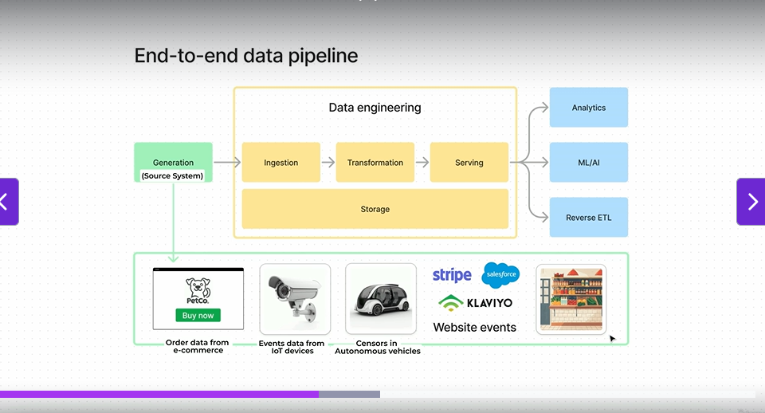

Got it 👍 Here are **easy-to-read notes** from that passage, broken into clear sections:

---

## 📌 Data Pipeline & Undercurrents

### 🔹 Two main parts:

1. **Data Pipeline (top layer)** → main flow of data (tasks we do as data engineers).
2. **Undercurrents (bottom layer)** → cross-cutting concerns that support the whole pipeline.

   * Term borrowed from *Fundamentals of Data Engineering* book by Joe Reese & Matt Housley.

Both layers are **essential for delivering high-quality data** to consumers.

---

## 🛠️ Data Pipeline Steps

1. **Data Generation**

   * Data created at source systems:

     * E-commerce orders.
     * Events from IoT devices (CCTV, sensors in autonomous vehicles).

2. **Ingestion (getting data into storage)**

   * Raw data is received and stored.
   * Sources could be:

     * Stripe (payments).
     * Salesforce (sales).
     * Klaviyo (marketing).
     * Website events.
   * Challenges:

     * Each source has its own **API**.
     * Some old systems don’t have APIs (they may drop a CSV file weekly).

3. **Storage**

   * Where ingested data is kept.
   * Options:

     * Relational DBs (MySQL, Postgres).
     * Object storage (AWS S3).
   * Storage is used **throughout the pipeline** (not just once).

4. **Transformation**

   * Clean, merge, and organize data.
   * Challenges:

     * Different naming conventions.
     * Duplicate data.
     * Conflicting values.
   * Goal: make data useful for consumers.

5. **Serving**

   * Deliver prepared data to end consumers:

     * **Analytics** → dashboards, reports.
     * **ML** → training models.
     * **AI** → advanced use cases.
     * **Reverse ETL** → send data back to apps.

---

## ⚡ Mental Model: Compute vs. Storage

* **Data** = information that must be transformed to be useful.
* **Compute** = processing power used to transform/change data.
* **Storage** = place to keep data (since we need it more than once).
* Pipeline = compute (top) + storage (bottom).
* Many modern data tools are built with this compute/storage separation in mind.

---

## 🌊 Undercurrents (cut across all pipeline stages)

These are **non-functional but critical aspects**:

* **Orchestration** → scheduling & managing data workflows (e.g., Airflow).
* **Security** → protecting sensitive data.
* **Data Governance** → ensuring compliance, ownership, and policies.
* **DataOps** → DevOps practices applied to data (CI/CD, monitoring, automation).
* **Data Quality** → accuracy, completeness, consistency of data.

---

